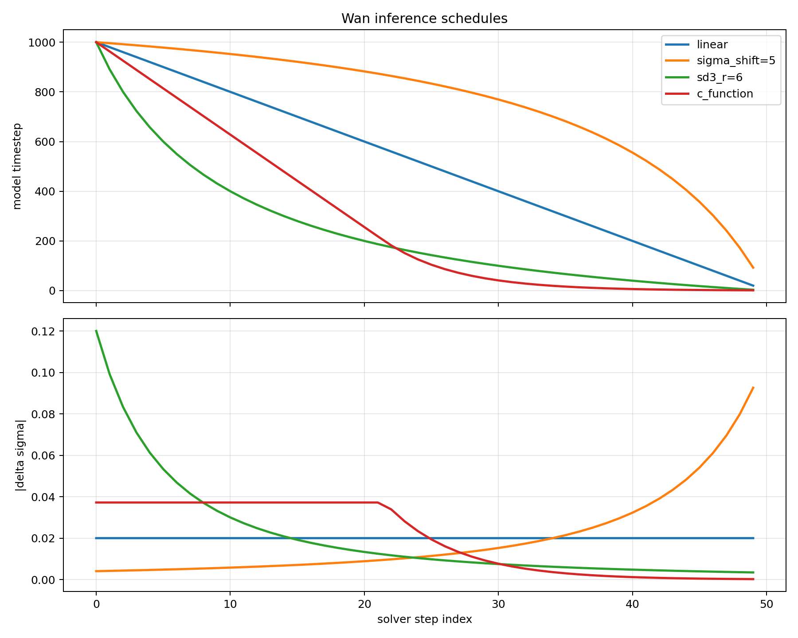

## VBVR: A Very Big Video Reasoning Suite

<div align="center">

<p align="center">
    <a href="https://video-reason.com/" target="_blank">
        
    </a>
    <a href="https://arxiv.org/abs/2602.20159" target="_blank">
        
    </a>
    <a href="https://huggingface.co/Video-Reason/VBVR-Wan2.2" target="_blank">
        
    </a>
    <a href="https://huggingface.co/datasets/Video-Reason/VBVR-Dataset" target="_blank">
        
    </a>
    <a href="https://huggingface.co/datasets/Video-Reason/VBVR-Bench-Data" target="_blank">
        
    </a>
    <a href="https://huggingface.co/spaces/Video-Reason/VBVR-Bench-Leaderboard" target="_blank">
        
    </a>
    <a href="https://github.com/Video-Reason/VBVR-EvalKit" target="_blank">
        
    </a>
    <a href="https://github.com/Video-Reason/VBVR-Wan2.2" target="_blank">
        
    </a>
    <a href="https://github.com/Video-Reason/VBVR-DataFactory" target="_blank">
        
    </a>
    <a href="https://www.youtube.com/watch?v=Gs9TPZmzo-s" target="_blank">
        
    </a>
</p>

</div>

This repository provides the training and inference code for the **VBVR** (A Very Big Video Reasoning Suite) project. We support fine-tuning **Wan2.2-I2V-A14B** and **LTX-2.3** video generation models on the VBVR dataset and evaluating them on the VBVR-Bench benchmark.


### 1. Installation

```bash
git clone https://github.com/Video-Reason/VBVR-Wan2.2.git
cd VBVR-Wan2.2
pip install -e .
```

### 2. Download Base Models

Before training, we recommand to download the base model weights first. This ensures all model files are available locally and avoids incomplete downloads during training.

#### Wan2.2-I2V-A14B

Download from [Hugging Face](https://huggingface.co/Wan-AI/Wan2.2-I2V-A14B):

```bash
huggingface-cli download Wan-AI/Wan2.2-I2V-A14B --local-dir ./models/Wan-AI/Wan2.2-I2V-A14B
```

Or from ModelScope:

```bash
modelscope download Wan-AI/Wan2.2-I2V-A14B --local_dir ./models/Wan-AI/Wan2.2-I2V-A14B
```

#### LTX-2.3

```bash
modelscope download DiffSynth-Studio/LTX-2.3-Repackage --local-dir ./models/DiffSynth-Studio/LTX-2.3-Repackage
```

> **Note:** The training pipeline will attempt to download models automatically if they are not found locally. However, in multi-GPU distributed training, concurrent downloads can be unreliable — especially with `DIFFSYNTH_DOWNLOAD_SOURCE="huggingface"`, where `huggingface_hub` may silently return an incomplete local cache without raising an error. **We strongly recommend downloading all model files before starting training.**

### 3. Download Training Data (VBVR-Dataset)

Download the VBVR-Dataset from Hugging Face and extract it into the `data/` directory:

```bash
# Install huggingface_hub if not already installed
pip install huggingface_hub

# Download the dataset
huggingface-cli download Video-Reason/VBVR-Dataset --repo-type dataset --local-dir ./data/VBVR-Dataset
```

After downloading, the training data config file [`configs/vbvr_dataset.json`](configs/vbvr_dataset.json) expects the following structure:

```
data/
└── VBVR-Dataset/
    ├── G-11_handle_object_reappearance_data-generator/
    │   ├── {task_id}/
    │   │   ├── first_frame.png       (required)
    │   │   ├── final_frame.png       (optional)
    │   │   ├── prompt.txt            (required)
    │   │   ├── ground_truth.mp4      (optional)
    │   │   └── metadata.json         (optional)
    │   └── ...
    ├── G-12_grid_obtaining_award_data-generator/
    └── ...
```

### 4. Training

#### Wan2.2-I2V-A14B

Wan2.2-I2V-A14B uses a MOE architecture with separate high-noise and low-noise models. The training script trains LoRA adapters for both:

| Model | Timestep Range | Description |
|-------|---------------|-------------|
| High Noise (`dit`) | 0 – 0.358 | Handles early denoising steps |
| Low Noise (`dit2`) | 0.358 – 1.0 | Handles later denoising steps |

```bash
# Single-node multi-GPU training (default: 8 GPUs)
bash scripts/Wan2.2-I2V-14B_vbvr_dataset.sh

# Customize GPU/node count via environment variables
NUM_GPUS=4 NUM_NODES=2 MASTER_ADDR=<master_ip> bash scripts/Wan2.2-I2V-14B_vbvr_dataset.sh
```

See [`scripts/Wan2.2-I2V-14B_vbvr_dataset.sh`](scripts/Wan2.2-I2V-14B_vbvr_dataset.sh) for all configurable parameters.

#### Wan2.2-TI2V-5B

Wan2.2-TI2V-5B now supports two full-finetuning modes:

- `flow`: standard flow-matching finetuning with the usual timestep conditioning.
- `eqf`: equilibrium forcing finetuning, which keeps the same noisy latents and loss target but passes a zeroed timestep tensor into the model during both training and inference.

EqF checkpoints are saved separately from flow checkpoints, carry mode metadata, and benchmark inference auto-detects the mode by default when you pass `--dit-checkpoint`.

Flow-matching finetuning:

```bash
export REPO_DIR=$(pwd)
export PYTHONPATH="${REPO_DIR}:${PYTHONPATH:-}"

accelerate launch \
    --num_processes 2 \
    --main_process_port 29500 \
    examples/wanvideo/model_training/train.py \
    --dataset_config_path ./configs/vbvr_dataset.json \
    --height 384 \
    --width 384 \
    --num_frames 209 \
    --batch_size 1 \
    --gradient_accumulation_steps 1 \
    --dataset_num_workers 4 \
    --dataloader_prefetch_factor 2 \
    --dataloader_pin_memory \
    --dataloader_persistent_workers \
    --dataset_repeat 1 \
    --data_file_keys clip_path \
    --model_paths "[ [ \"./models/Wan-AI/Wan2.2-TI2V-5B/diffusion_pytorch_model-00001-of-00003.safetensors\", \"./models/Wan-AI/Wan2.2-TI2V-5B/diffusion_pytorch_model-00002-of-00003.safetensors\", \"./models/Wan-AI/Wan2.2-TI2V-5B/diffusion_pytorch_model-00003-of-00003.safetensors\" ], \"./models/Wan-AI/Wan2.2-TI2V-5B/models_t5_umt5-xxl-enc-bf16.pth\", \"./models/Wan-AI/Wan2.2-TI2V-5B/Wan2.2_VAE.pth\" ]" \
    --learning_rate 1e-5 \
    --num_epochs 1 \
    --save_steps 5000 \
    --output_path ./outputs/Wan2.2-TI2V-5B_flow_vbvr \
    --remove_prefix_in_ckpt pipe.dit. \
    --trainable_models dit \
    --extra_inputs input_image \
    --finetuning_mode flow \
    --use_gradient_checkpointing \
    --eval_bench_root ./data/VBVR-Bench \
    --evalkit_path ../VBVR-EvalKit \
    --eval_steps 5000 \
    --eval_num_videos 8 \
    --eval_videos_per_task 1 \
    --eval_splits In-Domain_50 \
    --eval_run_numeric
```

Equilibrium forcing finetuning:

```bash
export REPO_DIR=$(pwd)
export PYTHONPATH="${REPO_DIR}:${PYTHONPATH:-}"

accelerate launch \
    --num_processes 2 \
    --main_process_port 29500 \
    examples/wanvideo/model_training/train.py \
    --dataset_config_path ./configs/vbvr_dataset.json \
    --height 384 \
    --width 384 \
    --num_frames 209 \
    --batch_size 1 \
    --gradient_accumulation_steps 4 \
    --dataset_num_workers 4 \
    --dataloader_prefetch_factor 2 \
    --dataloader_pin_memory \
    --dataloader_persistent_workers \
    --dataset_repeat 1 \
    --data_file_keys clip_path \
    --model_paths "[ [ \"./models/Wan-AI/Wan2.2-TI2V-5B/diffusion_pytorch_model-00001-of-00003.safetensors\", \"./models/Wan-AI/Wan2.2-TI2V-5B/diffusion_pytorch_model-00002-of-00003.safetensors\", \"./models/Wan-AI/Wan2.2-TI2V-5B/diffusion_pytorch_model-00003-of-00003.safetensors\" ], \"./models/Wan-AI/Wan2.2-TI2V-5B/models_t5_umt5-xxl-enc-bf16.pth\", \"./models/Wan-AI/Wan2.2-TI2V-5B/Wan2.2_VAE.pth\" ]" \
    --learning_rate 1e-5 \
    --num_epochs 1 \
    --save_steps 2500 \
    --output_path ./outputs/Wan2.2-TI2V-5B_eqf_vbvr \
    --remove_prefix_in_ckpt pipe.dit. \
    --trainable_models dit \
    --extra_inputs input_image \
    --finetuning_mode eqf \
    --eval_bench_root ./data/VBVR-Bench \
    --evalkit_path ../VBVR-EvalKit \
    --eval_steps 2500 \
    --eval_num_videos 8 \
    --eval_videos_per_task 1 \
    --eval_splits In-Domain_50 \
    --eval_inference_schedule c_function \
    --eval_run_numeric \
    --use_gradient_checkpointing
```

In `--model_paths`, the three `.safetensors` files are the Wan DiT checkpoint shards, followed by the T5 text encoder checkpoint and the VAE checkpoint.

`--use_gradient_checkpointing` is optional, but it is recommended when memory is tight. Namely on H100 we need it, but on H200 we don't.

The `--eval_*` arguments are optional. They enable periodic VBVR-Bench inference during training, saving generated videos under `./outputs/Wan2.2-TI2V-5B_<mode>_vbvr/vbvr_eval/step-*`. Add `--eval_run_numeric` together with `--evalkit_path` to also run VBVR-EvalKit and log quantitative metrics at each eval step. For EqF runs, use `c_function` for periodic benchmark evaluation.

#### LTX-2.3 I2AV

LTX-2.3 training uses a two-stage approach: data processing (encoding) followed by LoRA training:

```bash
# Single-node multi-GPU training (default: 8 GPUs)
bash scripts/LTX2.3-I2AV_vbvr_dataset.sh

# Customize GPU/node count via environment variables
NUM_GPUS=4 NUM_NODES=2 MASTER_ADDR=<master_ip> bash scripts/LTX2.3-I2AV_vbvr_dataset.sh
```

See [`scripts/LTX2.3-I2AV_vbvr_dataset.sh`](scripts/LTX2.3-I2AV_vbvr_dataset.sh) for all configurable parameters.


### 5. Download Evaluation Data (VBVR-Bench)

Download the VBVR-Bench evaluation data from Hugging Face:

```bash
huggingface-cli download Video-Reason/VBVR-Bench-Data --repo-type dataset --local-dir ./data/VBVR-Bench
```

The evaluation data has the following structure:

```
data/VBVR-Bench/
├── In-Domain_50/
│   ├── G-xxx_task_name_data-generator/
│   │   ├── 00000/
│   │   │   ├── first_frame.png
│   │   │   ├── final_frame.png
│   │   │   ├── ground_truth.mp4
│   │   │   └── prompt.txt
│   │   ├── 00001/
│   │   └── ...
│   └── ...
└── Out-of-Domain_50/
    └── ...
```

### 6. Before Evaluation, Inference on VBVR-Bench data

#### Wan2.2-TI2V-5B Stable Inference

The Wan flow-matching path in this repo uses the latent convention `z_sigma = (1 - sigma) * x0 + sigma * eps`, predicts the velocity target `eps - x0`, and advances samples with an Euler step `z_next = z + v_hat * delta_sigma`. The new inference schedule options change how solver noise levels are mapped to model timesteps and how much sigma distance is taken per solver step, while leaving that base convention unchanged.

The benchmark runner now supports four schedule modes:

- `linear`: evenly spaced sigma schedule without a warp
- `sigma_shift`: the legacy Wan schedule, controlled by `--sigma-shift`
- `sd3`: EqF-style SD3 warp, controlled by `--schedule-sd3-r`
- `c_function`: EqF-style c-function warp, controlled by `--schedule-c-*`

```bash
PYTHONPATH=$(pwd):${PYTHONPATH:-} DIFFSYNTH_SKIP_DOWNLOAD=True accelerate launch --num_processes 1 \
    ./scripts/run_wan22_ti2v5b_vbvr_bench.py \
    --bench-root ./data/VBVR-Bench \
    --model-dir ./models/Wan-AI/Wan2.2-TI2V-5B \
    --output-root ./outputs/wan22_ti2v5b_vbvr_bench_sd3 \
    --splits In-Domain_50 \
    --max-videos 2 \
    --videos-per-task 1 \
    --num-inference-steps 50 \
    --inference-schedule sd3 \
    --schedule-sd3-r 6.0 \
    --target-num-frames 209 \
    --fps 16 \
    --seed 1 \
    --sample-seed 1234 \
    --overwrite \
    --no-run-evalkit
```

You can generate the schedule comparison figure from the same implementation used at inference time with:

```bash
PYTHONPATH=$(pwd):${PYTHONPATH:-} python ./scripts/plot_wan_inference_schedules.py \
    --output-path ./docs/assets/wan_inference_schedules.png
```

The generated figure is tracked at `docs/assets/wan_inference_schedules.png`:



#### Wan2.2-I2V-A14B Inference

```bash
# Evaluate with trained LoRA
python examples/wanvideo/model_training/validate_lora/eval_vbvr_bench.py \
    --eval_root ./data/VBVR-Bench \
    --output_root ./outputs/eval/VBVR-Wan2.2 \
    --high_noise_lora_path ./outputs/Wan2.2-I2V-14B_vbvr/high_noise/epoch-0.safetensors \
    --low_noise_lora_path ./outputs/Wan2.2-I2V-14B_vbvr/low_noise/epoch-0.safetensors

# Evaluate base model (no LoRA)
python examples/wanvideo/model_training/validate_lora/eval_vbvr_bench.py \
    --eval_root ./data/VBVR-Bench \
    --output_root ./outputs/eval/Wan2.2_base
```

#### LTX-2.3 Inference

```bash
# Evaluate with trained LoRA
python examples/ltx2/model_training/validate_lora/eval_vbvr_bench.py \
    --eval_root ./data/VBVR-Bench \
    --output_root ./outputs/eval/LTX2.3_lora \
    --lora_path ./outputs/LTX2.3-I2AV_vbvr/model/epoch-0.safetensors 

# Evaluate base model (no LoRA)
python examples/ltx2/model_training/validate_lora/eval_vbvr_bench.py \
    --eval_root ./data/VBVR-Bench \
    --output_root ./outputs/eval/LTX2.3_base 
```
### 7. Evaluation on VBVR-Bench

After generating videos, you can evaluateyour results on the [VBVR-Bench](https://github.com/Video-Reason/VBVR-EvalKit) following the instructions.

### 8. Submit Results to Leaderboard

After evaluation, you can submit your results to the [VBVR-Bench Leaderboard](https://huggingface.co/spaces/Video-Reason/VBVR-Bench-Leaderboard) following the instructions on the leaderboard page.

### Citation

```bibtex
@article{vbvr2026,
      title={A Very Big Video Reasoning Suite}, 
      author={Maijunxian Wang and Ruisi Wang and Juyi Lin and Ran Ji and Thaddäus Wiedemer and Qingying Gao and Dezhi Luo and Yaoyao Qian and Lianyu Huang and Zelong Hong and Jiahui Ge and Qianli Ma and Hang He and Yifan Zhou and Lingzi Guo and Lantao Mei and Jiachen Li and Hanwen Xing and Tianqi Zhao and Fengyuan Yu and Weihang Xiao and Yizheng Jiao and Jianheng Hou and Danyang Zhang and Pengcheng Xu and Boyang Zhong and Zehong Zhao and Gaoyun Fang and John Kitaoka and Yile Xu and Hua Xu and Kenton Blacutt and Tin Nguyen and Siyuan Song and Haoran Sun and Shaoyue Wen and Linyang He and Runming Wang and Yanzhi Wang and Mengyue Yang and Ziqiao Ma and Raphaël Millière and Freda Shi and Nuno Vasconcelos and Daniel Khashabi and Alan Yuille and Yilun Du and Ziming Liu and Bo Li and Dahua Lin and Ziwei Liu and Vikash Kumar and Yijiang Li and Lei Yang and Zhongang Cai and Hokin Deng},
  journal = {arXiv preprint arXiv:2602.20159},
  year = {2026}
}
```

### Acknowledgements

This project includes code that is modified from the original work by the DiffSynth-Studio team.

* Source repository: https://github.com/modelscope/DiffSynth-Studio
* Original project: **modelscope/DiffSynth-Studio**

We gratefully acknowledge the authors and contributors of DiffSynth-Studio for their work.
Please refer to the original repository for full details, updates, and licensing information.
